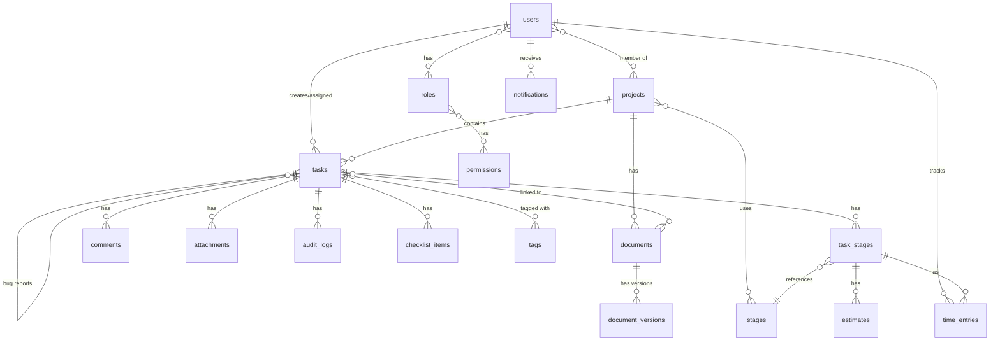

# Документ проектирования: Система управления проектами

## Обзор

Система управления проектами - это self-hosted веб-приложение на базе Laravel и MoonShine, предназначенное для управления задачами, проектами и командой разработки. Система использует архитектуру MVC с дополнительными слоями для бизнес-логики и предоставляет административную панель на базе MoonShine для управления всеми сущностями.

### Технологический стек

- **Backend Framework**: Laravel 10.x
- **Admin Panel**: MoonShine 2.x
- **Database**: MySQL 8.0+ / PostgreSQL 13+
- **PHP Version**: 8.3+
- **Frontend**: Blade Templates + Alpine.js (для интерактивности)
- **CSS Framework**: Tailwind CSS (встроен в MoonShine)

## Архитектура

### Общая архитектура

Система следует архитектуре Laravel MVC с дополнительными слоями:

```
┌─────────────────────────────────────────────────────────┐
│                    Presentation Layer                    │
│  ┌──────────────────┐         ┌──────────────────┐     │
│  │  MoonShine Admin │         │  Blade Views     │     │
│  │    Resources     │         │  (User Interface)│     │
│  └──────────────────┘         └──────────────────┘     │
└─────────────────────────────────────────────────────────┘
                          │
┌─────────────────────────────────────────────────────────┐
│                   Application Layer                      │
│  ┌──────────────────┐         ┌──────────────────┐     │
│  │   Controllers    │         │    Services      │     │
│  │                  │────────▶│  (Business Logic)│     │
│  └──────────────────┘         └──────────────────┘     │
└─────────────────────────────────────────────────────────┘
                          │
┌─────────────────────────────────────────────────────────┐
│                     Domain Layer                         │
│  ┌──────────────────┐         ┌──────────────────┐     │
│  │  Eloquent Models │         │   Repositories   │     │
│  │                  │◀────────│   (Optional)     │     │
│  └──────────────────┘         └──────────────────┘     │
└─────────────────────────────────────────────────────────┘
                          │
┌─────────────────────────────────────────────────────────┐
│                  Infrastructure Layer                    │
│  ┌──────────────────┐         ┌──────────────────┐     │
│  │    Database      │         │  File Storage    │     │
│  │  (MySQL/PgSQL)   │         │   (Local/S3)     │     │
│  └──────────────────┘         └──────────────────┘     │
└─────────────────────────────────────────────────────────┘
```

### Структура директорий

```
app/
├── Http/
│   ├── Controllers/          # Контроллеры для пользовательского интерфейса
│   ├── Middleware/           # Middleware для авторизации и аудита
│   └── Requests/             # Form Requests для валидации
├── Models/                   # Eloquent модели
├── Services/                 # Бизнес-логика
├── MoonShine/
│   └── Resources/            # MoonShine ресурсы для админ-панели
├── Policies/                 # Политики авторизации
├── Observers/                # Observers для аудит-лога
└── Enums/                    # Enums для статусов, приоритетов и т.д.

database/
├── migrations/               # Миграции базы данных
├── seeders/                  # Сидеры для начальных данных
└── factories/                # Фабрики для тестирования

resources/
├── views/                    # Blade шаблоны
│   ├── projects/
│   ├── tasks/
│   ├── kanban/
│   └── calendar/
└── js/                       # Alpine.js компоненты

config/
└── moonshine.php             # Конфигурация MoonShine
```

## Компоненты и интерфейсы

### Модели данных (Eloquent Models)

#### User Model
```php
class User extends Authenticatable
{
    protected $fillable = [
        'name', 'email', 'password', 'hourly_rate'
    ];
    
    // Relationships
    public function roles(): BelongsToMany;
    public function projects(): BelongsToMany;
    public function assignedTasks(): HasMany;
    public function createdTasks(): HasMany;
    public function timeEntries(): HasMany;
    public function notifications(): HasMany;
}
```

#### Role Model
```php
class Role extends Model
{
    protected $fillable = ['name', 'description'];
    
    // Relationships
    public function users(): BelongsToMany;
    public function permissions(): BelongsToMany;
}
```

#### Permission Model
```php
class Permission extends Model
{
    protected $fillable = ['name', 'description', 'action'];
    
    // Relationships
    public function roles(): BelongsToMany;
}
```

#### Project Model
```php
class Project extends Model
{
    protected $fillable = [
        'name', 'description', 'type', 'status'
    ];
    
    protected $casts = [
        'type' => ProjectType::class,
        'status' => ProjectStatus::class
    ];
    
    // Relationships
    public function tasks(): HasMany;
    public function stages(): BelongsToMany;
    public function members(): BelongsToMany;
    public function documents(): HasMany;
}
```

#### Stage Model (Справочник этапов)
```php
class Stage extends Model
{
    protected $fillable = ['name', 'description', 'order'];
    
    // Relationships
    public function projects(): BelongsToMany;
    public function taskStages(): HasMany;
}
```

#### Task Model
```php
class Task extends Model
{
    protected $fillable = [
        'title', 'description', 'project_id', 'author_id',
        'assignee_id', 'priority', 'status', 'due_date'
    ];
    
    protected $casts = [
        'priority' => TaskPriority::class,
        'status' => TaskStatus::class,
        'due_date' => 'datetime'
    ];
    
    // Relationships
    public function project(): BelongsTo;
    public function author(): BelongsTo;
    public function assignee(): BelongsTo;
    public function tags(): BelongsToMany;
    public function taskStages(): HasMany;
    public function comments(): HasMany;
    public function attachments(): HasMany;
    public function auditLogs(): HasMany;
    public function checklistItems(): HasMany;
    public function bugReports(): HasMany;  // Связанные баг-репорты
    public function parentTask(): BelongsTo;  // Для баг-репортов
    public function documents(): BelongsToMany;
}
```

#### TaskStage Model (Этапы конкретной задачи)
```php
class TaskStage extends Model
{
    protected $fillable = [
        'task_id', 'stage_id', 'status', 'order'
    ];
    
    protected $casts = [
        'status' => StageStatus::class
    ];
    
    // Relationships
    public function task(): BelongsTo;
    public function stage(): BelongsTo;
    public function estimates(): HasMany;
    public function timeEntries(): HasMany;
}
```

#### Estimate Model (Оценки времени)
```php
class Estimate extends Model
{
    protected $fillable = [
        'task_stage_id', 'user_id', 'hours'
    ];
    
    // Relationships
    public function taskStage(): BelongsTo;
    public function user(): BelongsTo;
}
```

#### TimeEntry Model (Учет времени)
```php
class TimeEntry extends Model
{
    protected $fillable = [
        'task_stage_id', 'user_id', 'hours', 
        'date', 'description', 'cost'
    ];
    
    protected $casts = [
        'date' => 'date',
        'hours' => 'decimal:2',
        'cost' => 'decimal:2'
    ];
    
    // Relationships
    public function taskStage(): BelongsTo;
    public function user(): BelongsTo;
    
    // Calculated fields
    public function calculateCost(): float;
}
```

#### Tag Model
```php
class Tag extends Model
{
    protected $fillable = ['name', 'color'];
    
    // Relationships
    public function tasks(): BelongsToMany;
}
```

#### Comment Model
```php
class Comment extends Model
{
    protected $fillable = [
        'task_id', 'user_id', 'content', 'deleted_at'
    ];
    
    protected $casts = [
        'deleted_at' => 'datetime'
    ];
    
    // Relationships
    public function task(): BelongsTo;
    public function user(): BelongsTo;
}
```

#### Attachment Model
```php
class Attachment extends Model
{
    protected $fillable = [
        'task_id', 'user_id', 'filename', 
        'original_name', 'mime_type', 'size', 'path'
    ];
    
    // Relationships
    public function task(): BelongsTo;
    public function user(): BelongsTo;
}
```

#### AuditLog Model
```php
class AuditLog extends Model
{
    protected $fillable = [
        'task_id', 'user_id', 'field', 
        'old_value', 'new_value', 'created_at'
    ];
    
    protected $casts = [
        'created_at' => 'datetime'
    ];
    
    // Relationships
    public function task(): BelongsTo;
    public function user(): BelongsTo;
}
```

#### ChecklistItem Model
```php
class ChecklistItem extends Model
{
    protected $fillable = [
        'task_id', 'title', 'is_completed', 'order'
    ];
    
    protected $casts = [
        'is_completed' => 'boolean'
    ];
    
    // Relationships
    public function task(): BelongsTo;
}
```

#### Document Model (База знаний)
```php
class Document extends Model
{
    protected $fillable = [
        'title', 'content', 'category', 'project_id',
        'author_id', 'version'
    ];
    
    protected $casts = [
        'category' => DocumentCategory::class,
        'version' => 'integer'
    ];
    
    // Relationships
    public function project(): BelongsTo;
    public function author(): BelongsTo;
    public function tasks(): BelongsToMany;
    public function versions(): HasMany;
}
```

#### DocumentVersion Model
```php
class DocumentVersion extends Model
{
    protected $fillable = [
        'document_id', 'content', 'version', 
        'user_id', 'created_at'
    ];
    
    protected $casts = [
        'version' => 'integer',
        'created_at' => 'datetime'
    ];
    
    // Relationships
    public function document(): BelongsTo;
    public function user(): BelongsTo;
}
```

#### Notification Model
```php
class Notification extends Model
{
    protected $fillable = [
        'user_id', 'type', 'title', 'message',
        'data', 'read_at'
    ];
    
    protected $casts = [
        'data' => 'array',
        'read_at' => 'datetime'
    ];
    
    // Relationships
    public function user(): BelongsTo;
}
```

### Enums

#### ProjectType Enum
```php
enum ProjectType: string
{
    case MOBILE_APP = 'mobile_app';
    case TELEGRAM_BOT = 'telegram_bot';
    case WEBSITE = 'website';
    case CRM_SYSTEM = 'crm_system';
    
    public function getDefaultStages(): array;
}
```

#### TaskPriority Enum
```php
enum TaskPriority: string
{
    case HIGH = 'high';
    case MEDIUM = 'medium';
    case LOW = 'low';
    case FROZEN = 'frozen';
}
```

#### TaskStatus Enum
```php
enum TaskStatus: string
{
    case TODO = 'todo';
    case IN_PROGRESS = 'in_progress';
    case IN_TESTING = 'in_testing';
    case TEST_FAILED = 'test_failed';
    case DONE = 'done';
    
    public function canTransitionTo(TaskStatus $newStatus): bool;
}
```

#### DocumentCategory Enum
```php
enum DocumentCategory: string
{
    case API_DOCUMENTATION = 'api_documentation';
    case ARCHITECTURE = 'architecture';
    case INTEGRATION_GUIDE = 'integration_guide';
    case GENERAL_NOTES = 'general_notes';
}
```

### Services (Бизнес-логика)

#### TaskService
```php
class TaskService
{
    public function createTask(array $data): Task;
    public function updateTask(Task $task, array $data): Task;
    public function assignTask(Task $task, User $user): void;
    public function takeTask(Task $task, User $user): void;
    public function changeStatus(Task $task, TaskStatus $status): void;
    public function createTaskStages(Task $task): void;
}
```

#### TimeTrackingService
```php
class TimeTrackingService
{
    public function startTimer(TaskStage $taskStage, User $user): void;
    public function stopTimer(TaskStage $taskStage, User $user): TimeEntry;
    public function addManualEntry(array $data): TimeEntry;
    public function calculateCost(TimeEntry $entry): float;
    public function getTaskTotalHours(Task $task): float;
    public function getProjectTotalHours(Project $project): float;
    public function getUserTotalHours(User $user, ?Carbon $from, ?Carbon $to): float;
}
```

#### NotificationService
```php
class NotificationService
{
    public function notifyTaskAssigned(Task $task): void;
    public function notifyStatusChanged(Task $task, TaskStatus $oldStatus): void;
    public function notifyCommentAdded(Comment $comment): void;
    public function notifyDeadlineApproaching(Task $task): void;
    public function notifyDeadlineExpired(Task $task): void;
    public function notifyTaskReadyForTesting(Task $task): void;
    public function notifyBugReportCreated(Task $bugReport, Task $originalTask): void;
    public function notifyAllBugsFixed(Task $task): void;
}
```

#### AuditService
```php
class AuditService
{
    public function logChange(Task $task, string $field, $oldValue, $newValue): void;
    public function getTaskHistory(Task $task): Collection;
}
```

#### TestingService
```php
class TestingService
{
    public function createChecklist(Task $task, array $items): Collection;
    public function toggleChecklistItem(ChecklistItem $item): void;
    public function getChecklistProgress(Task $task): float;
    public function createBugReport(Task $task, array $data): Task;
    public function linkBugReport(Task $bugReport, Task $originalTask): void;
    public function checkAllBugsFixed(Task $task): bool;
}
```

#### DocumentService
```php
class DocumentService
{
    public function createDocument(array $data): Document;
    public function updateDocument(Document $document, array $data): Document;
    public function attachToTask(Document $document, Task $task): void;
    public function createVersion(Document $document, string $content, User $user): DocumentVersion;
    public function searchDocuments(string $query): Collection;
}
```

#### ReportService
```php
class ReportService
{
    public function getTaskTimeReport(Task $task): array;
    public function getProjectTimeReport(Project $project): array;
    public function getUserPaymentReport(User $user, Carbon $from, Carbon $to): array;
    public function getTeamPaymentReport(Carbon $from, Carbon $to): array;
}
```

### Policies (Авторизация)

#### TaskPolicy
```php
class TaskPolicy
{
    public function view(User $user, Task $task): bool;
    public function create(User $user): bool;
    public function update(User $user, Task $task): bool;
    public function delete(User $user, Task $task): bool;
    public function assign(User $user, Task $task): bool;
    public function take(User $user, Task $task): bool;
    public function changeStatus(User $user, Task $task, TaskStatus $newStatus): bool;
}
```

#### ProjectPolicy
```php
class ProjectPolicy
{
    public function view(User $user, Project $project): bool;
    public function create(User $user): bool;
    public function update(User $user, Project $project): bool;
    public function delete(User $user, Project $project): bool;
    public function manageMembers(User $user, Project $project): bool;
}
```

### Observers

#### TaskObserver
```php
class TaskObserver
{
    public function updated(Task $task): void
    {
        // Логирование изменений в аудит-лог
        // Отправка уведомлений при изменении статуса
    }
    
    public function created(Task $task): void
    {
        // Создание этапов задачи
    }
}
```

### MoonShine Resources

#### UserResource
```php
class UserResource extends ModelResource
{
    public string $model = User::class;
    
    public function fields(): array
    {
        return [
            ID::make(),
            Text::make('Name'),
            Email::make('Email'),
            Number::make('Hourly Rate'),
            BelongsToMany::make('Roles'),
            BelongsToMany::make('Projects')
        ];
    }
    
    public function rules(Model $item): array;
    public function filters(): array;
}
```

#### ProjectResource
```php
class ProjectResource extends ModelResource
{
    public string $model = Project::class;
    
    public function fields(): array
    {
        return [
            ID::make(),
            Text::make('Name'),
            Textarea::make('Description'),
            Select::make('Type')->options(ProjectType::cases()),
            BelongsToMany::make('Stages'),
            BelongsToMany::make('Members'),
            HasMany::make('Tasks')
        ];
    }
}
```

#### TaskResource
```php
class TaskResource extends ModelResource
{
    public string $model = Task::class;
    
    public function fields(): array
    {
        return [
            ID::make(),
            Text::make('Title'),
            Textarea::make('Description'),
            BelongsTo::make('Project'),
            BelongsTo::make('Author'),
            BelongsTo::make('Assignee'),
            Select::make('Priority')->options(TaskPriority::cases()),
            Select::make('Status')->options(TaskStatus::cases()),
            Date::make('Due Date'),
            BelongsToMany::make('Tags'),
            HasMany::make('Comments'),
            HasMany::make('Attachments')
        ];
    }
}
```

## Модели данных

### Схема базы данных



### Миграции

Основные таблицы базы данных:

1. **users** - пользователи системы
2. **roles** - роли пользователей
3. **permissions** - разрешения
4. **role_user** - связь пользователей и ролей (many-to-many)
5. **permission_role** - связь ролей и разрешений (many-to-many)
6. **projects** - проекты
7. **project_user** - участники проектов (many-to-many)
8. **stages** - справочник этапов
9. **project_stage** - этапы проектов (many-to-many)
10. **tasks** - задачи
11. **task_stages** - этапы конкретных задач
12. **estimates** - оценки времени
13. **time_entries** - записи затраченного времени
14. **tags** - теги
15. **task_tag** - связь задач и тегов (many-to-many)
16. **comments** - комментарии
17. **attachments** - прикрепленные файлы
18. **audit_logs** - история изменений
19. **checklist_items** - пункты чек-листов
20. **documents** - документы базы знаний
21. **document_task** - связь документов и задач (many-to-many)
22. **document_versions** - версии документов
23. **notifications** - уведомления

## Свойства корректности

*Свойство - это характеристика или поведение, которое должно выполняться для всех допустимых выполнений системы - по сути, формальное утверждение о том, что система должна делать. Свойства служат мостом между человекочитаемыми спецификациями и машинно-проверяемыми гарантиями корректности.*


### Свойства на основе требований

Property 1: Пользователь всегда имеет роль
*Для любого* созданного пользователя, у него должна быть назначена хотя бы одна роль
**Validates: Requirements 1.1**

Property 2: Авторизация проверяет все роли
*Для любого* пользователя и действия, система должна проверить разрешения всех ролей пользователя перед выполнением действия
**Validates: Requirements 1.7**

Property 3: Пользовательские роли создаются корректно
*Для любой* пользовательской роли, она должна иметь уникальное название и может иметь произвольный набор разрешений
**Validates: Requirements 1.3**

Property 4: Этапы требуют обязательные поля
*Для любого* этапа, он должен иметь непустое название
**Validates: Requirements 2.3**

Property 5: Связь проекта и этапов сохраняется
*Для любого* проекта и этапа, если этап добавлен к проекту, то он должен присутствовать в списке этапов проекта
**Validates: Requirements 2.13**

Property 6: Этапы задачи принадлежат проекту
*Для любой* задачи, все ее этапы (TaskStage) должны ссылаться на этапы (Stage), которые связаны с проектом задачи
**Validates: Requirements 2.14**

Property 7: Автоматическое создание этапов задачи
*Для любой* созданной задачи, количество записей TaskStage должно равняться количеству этапов, связанных с проектом задачи
**Validates: Requirements 3.2**

Property 8: Действие "взять в работу" устанавливает исполнителя и статус
*Для любой* задачи без исполнителя, после действия "взять в работу" пользователем, этот пользователь должен стать исполнителем и статус должен измениться на "в работе"
**Validates: Requirements 3.8**

Property 9: Уведомления о приближающемся дедлайне
*Для любой* задачи с дедлайном через 24 часа, система должна создать уведомления для исполнителя и всех проект-менеджеров проекта
**Validates: Requirements 3.11**

Property 10: Просроченные задачи помечаются
*Для любой* задачи, если текущая дата больше срока выполнения и статус не "выполнено", задача должна быть помечена как просроченная
**Validates: Requirements 3.12**

Property 11: Оценки времени независимы
*Для любого* этапа задачи, оценки времени разных специалистов должны сохраняться независимо и не перезаписывать друг друга
**Validates: Requirements 4.2**

Property 12: Суммирование времени по задаче
*Для любой* задачи, сумма всех записей времени по задаче должна равняться сумме всех записей времени по всем этапам этой задачи
**Validates: Requirements 5.6**

Property 13: Расчет стоимости времени
*Для любой* записи времени (TimeEntry), стоимость должна равняться произведению количества часов на ставку пользователя
**Validates: Requirements 6.2**

Property 14: Аудит-лог фиксирует изменения
*Для любого* изменения поля задачи, должна создаваться запись в аудит-логе с указанием пользователя, поля, старого и нового значения
**Validates: Requirements 7.1**

Property 15: Связи сохраняются корректно
*Для любой* сущности (комментарий, файл, документ, баг-репорт), при создании связи с задачей, эта сущность должна присутствовать в соответствующем списке задачи
**Validates: Requirements 8.1, 8.3, 11.6, 14.5**

Property 16: Композиция фильтров
*Для любого* набора фильтров, примененных одновременно, результирующий список задач должен удовлетворять всем условиям фильтров
**Validates: Requirements 9.8**

Property 17: Статус задачи соответствует колонке Kanban
*Для любой* задачи на Kanban доске, статус задачи должен соответствовать колонке, в которой она находится
**Validates: Requirements 10.4**

Property 18: Прогресс чек-листа рассчитывается корректно
*Для любого* чек-листа задачи, процент выполнения должен равняться (количество выполненных пунктов / общее количество пунктов) × 100
**Validates: Requirements 11.4**

Property 19: Переходы статусов валидны
*Для любой* задачи, переход из статуса "на тестировании" в статус "тест провален" должен быть разрешен
**Validates: Requirements 11.9**

Property 20: Уведомление о закрытии всех багов
*Для любой* задачи с баг-репортами, когда все связанные баг-репорты имеют статус "выполнено", должно создаваться уведомление для тестировщиков проекта
**Validates: Requirements 11.13**

Property 21: Задачи в календаре на правильных датах
*Для любой* задачи с дедлайном, в календарном представлении она должна отображаться на дате своего дедлайна
**Validates: Requirements 12.5**

Property 22: Версионирование документов
*Для любого* документа, каждое редактирование содержимого должно создавать новую версию с инкрементированным номером версии
**Validates: Requirements 14.12**

## Обработка ошибок

### Стратегия обработки ошибок

Система использует многоуровневую стратегию обработки ошибок:

1. **Валидация на уровне Request**
   - Form Requests Laravel для валидации входных данных
   - Автоматический возврат ошибок валидации в JSON или редирект с ошибками

2. **Бизнес-логика в Services**
   - Выброс специфичных исключений (TaskNotFoundException, UnauthorizedException)
   - Обработка в контроллерах с возвратом понятных сообщений

3. **Обработка на уровне Middleware**
   - Проверка авторизации через Policies
   - Логирование попыток несанкционированного доступа

4. **Глобальный обработчик исключений**
   - Handler.php для централизованной обработки
   - Логирование критических ошибок
   - Возврат пользовательских страниц ошибок

### Типы исключений

```php
// Domain Exceptions
class TaskNotFoundException extends Exception {}
class ProjectNotFoundException extends Exception {}
class UnauthorizedException extends Exception {}
class InvalidStatusTransitionException extends Exception {}
class DeadlineExpiredException extends Exception {}

// Validation Exceptions
class InvalidTimeEntryException extends Exception {}
class InvalidEstimateException extends Exception {}
class DuplicateRoleException extends Exception {}
```

### Обработка специфичных ошибок

1. **Ошибки авторизации**
   - Возврат 403 Forbidden
   - Логирование попытки доступа
   - Уведомление администратора при повторных попытках

2. **Ошибки валидации**
   - Возврат 422 Unprocessable Entity
   - Детальные сообщения об ошибках для каждого поля
   - Сохранение введенных данных для повторного заполнения формы

3. **Ошибки бизнес-логики**
   - Возврат 400 Bad Request
   - Понятные сообщения об ошибках для пользователя
   - Логирование для отладки

4. **Ошибки базы данных**
   - Откат транзакций
   - Логирование полной информации об ошибке
   - Возврат общего сообщения пользователю (без деталей БД)

5. **Ошибки файловой системы**
   - Проверка доступности хранилища перед загрузкой
   - Очистка временных файлов при ошибках
   - Уведомление администратора о проблемах с хранилищем

## Стратегия тестирования

### Подход к тестированию

Система использует двойной подход к тестированию:

1. **Unit тесты** - для конкретных примеров, граничных случаев и условий ошибок
2. **Property-based тесты** - для проверки универсальных свойств на множестве входных данных

Оба типа тестов дополняют друг друга и необходимы для полного покрытия.

### Property-Based Testing

**Библиотека**: Pest PHP с плагином Pest Property Testing

**Конфигурация**:
- Минимум 100 итераций на каждый property тест
- Каждый тест должен ссылаться на свойство из документа проектирования
- Формат тега: `Feature: project-management-system, Property {number}: {property_text}`

**Примеры property тестов**:

```php
// Property 1: Пользователь всегда имеет роль
test('user always has at least one role', function () {
    // Feature: project-management-system, Property 1
    $user = User::factory()->create();
    $role = Role::factory()->create();
    $user->roles()->attach($role);
    
    expect($user->roles)->toHaveCount(1);
})->repeat(100);

// Property 7: Автоматическое создание этапов задачи
test('task stages are created automatically', function () {
    // Feature: project-management-system, Property 7
    $project = Project::factory()->create();
    $stages = Stage::factory()->count(3)->create();
    $project->stages()->attach($stages);
    
    $task = Task::factory()->create(['project_id' => $project->id]);
    
    expect($task->taskStages)->toHaveCount(3);
})->repeat(100);

// Property 13: Расчет стоимости времени
test('time entry cost equals hours times rate', function () {
    // Feature: project-management-system, Property 13
    $user = User::factory()->create(['hourly_rate' => 50]);
    $hours = fake()->randomFloat(2, 1, 8);
    
    $timeEntry = TimeEntry::factory()->create([
        'user_id' => $user->id,
        'hours' => $hours
    ]);
    
    expect($timeEntry->cost)->toBe($hours * $user->hourly_rate);
})->repeat(100);
```

### Unit Testing

**Фокус unit тестов**:
- Конкретные примеры корректного поведения
- Граничные случаи (пустые значения, максимальные значения)
- Условия ошибок и исключения
- Интеграционные точки между компонентами

**Примеры unit тестов**:

```php
// Конкретный пример
test('project manager can create task', function () {
    $manager = User::factory()->create();
    $manager->roles()->attach(Role::where('name', 'project-manager')->first());
    
    $response = $this->actingAs($manager)->post('/tasks', [
        'title' => 'Test Task',
        'project_id' => 1
    ]);
    
    $response->assertStatus(201);
});

// Граничный случай
test('task cannot be created with empty title', function () {
    $response = $this->post('/tasks', ['title' => '']);
    $response->assertSessionHasErrors('title');
});

// Условие ошибки
test('unauthorized user cannot delete task', function () {
    $user = User::factory()->create();
    $task = Task::factory()->create();
    
    $response = $this->actingAs($user)->delete("/tasks/{$task->id}");
    $response->assertStatus(403);
});
```

### Тестовое покрытие

**Обязательное покрытие**:
- Все Services - 100% покрытие методов
- Все Policies - 100% покрытие правил авторизации
- Все Observers - 100% покрытие событий
- Критические контроллеры - минимум 80%

**Property тесты для каждого свойства**:
- Каждое свойство корректности должно иметь соответствующий property тест
- Минимум 100 итераций на тест
- Использование фабрик для генерации случайных данных

### Интеграционное тестирование

**Сценарии для интеграционных тестов**:
1. Полный цикл задачи: создание → назначение → выполнение → тестирование → завершение
2. Создание баг-репорта и его связь с исходной задачей
3. Трекинг времени и расчет выплат
4. Система уведомлений при различных событиях
5. Kanban доска с drag-and-drop изменением статусов

### Тестирование производительности

**Критерии производительности**:
- Загрузка списка задач (100 задач): < 200ms
- Создание задачи с этапами: < 100ms
- Расчет отчета по времени (1000 записей): < 500ms
- Поиск по задачам: < 300ms

### CI/CD Pipeline

**Автоматизация тестирования**:
1. Запуск всех тестов при каждом push
2. Property тесты с увеличенным количеством итераций (500) в nightly builds
3. Проверка покрытия кода (минимум 80%)
4. Статический анализ с PHPStan (level 8)
5. Code style проверка с PHP CS Fixer

## Дополнительные компоненты

### Команды Artisan

```php
// Отправка уведомлений о приближающихся дедлайнах
php artisan tasks:check-deadlines

// Очистка старых уведомлений
php artisan notifications:cleanup

// Генерация отчетов
php artisan reports:generate-monthly
```

### Scheduled Tasks (Cron)

```php
// app/Console/Kernel.php
protected function schedule(Schedule $schedule)
{
    // Проверка дедлайнов каждый час
    $schedule->command('tasks:check-deadlines')->hourly();
    
    // Очистка старых уведомлений раз в день
    $schedule->command('notifications:cleanup')->daily();
    
    // Генерация месячных отчетов
    $schedule->command('reports:generate-monthly')->monthlyOn(1, '00:00');
}
```

### Events и Listeners

```php
// Events
class TaskStatusChanged extends Event
{
    public function __construct(
        public Task $task,
        public TaskStatus $oldStatus,
        public TaskStatus $newStatus
    ) {}
}

class TaskAssigned extends Event
{
    public function __construct(
        public Task $task,
        public User $assignee
    ) {}
}

// Listeners
class SendTaskAssignedNotification
{
    public function handle(TaskAssigned $event): void
    {
        // Отправка уведомления
    }
}

class LogTaskStatusChange
{
    public function handle(TaskStatusChanged $event): void
    {
        // Логирование в аудит-лог
    }
}
```

### Middleware

```php
// Проверка доступа к проекту
class EnsureUserHasProjectAccess
{
    public function handle(Request $request, Closure $next)
    {
        $project = $request->route('project');
        
        if (!$request->user()->canAccessProject($project)) {
            abort(403);
        }
        
        return $next($request);
    }
}

// Аудит действий
class AuditMiddleware
{
    public function handle(Request $request, Closure $next)
    {
        $response = $next($request);
        
        // Логирование действия пользователя
        
        return $response;
    }
}
```

## Развертывание

### Требования к серверу

- PHP 8.1 или выше
- MySQL 8.0+ или PostgreSQL 13+
- Composer 2.x
- Node.js 18+ и NPM (для сборки фронтенда)
- Веб-сервер: Apache 2.4+ или Nginx 1.18+

### Конфигурация веб-сервера

**Nginx**:
```nginx
server {
    listen 80;
    server_name example.com;
    root /var/www/html/public;

    add_header X-Frame-Options "SAMEORIGIN";
    add_header X-Content-Type-Options "nosniff";

    index index.php;

    charset utf-8;

    location / {
        try_files $uri $uri/ /index.php?$query_string;
    }

    location = /favicon.ico { access_log off; log_not_found off; }
    location = /robots.txt  { access_log off; log_not_found off; }

    error_page 404 /index.php;

    location ~ \.php$ {
        fastcgi_pass unix:/var/run/php/php8.1-fpm.sock;
        fastcgi_param SCRIPT_FILENAME $realpath_root$fastcgi_script_name;
        include fastcgi_params;
    }

    location ~ /\.(?!well-known).* {
        deny all;
    }
}
```

**Apache (.htaccess уже включен в Laravel)**

### Процесс установки

1. Клонирование репозитория
2. Установка зависимостей: `composer install --no-dev`
3. Копирование `.env.example` в `.env`
4. Генерация ключа приложения: `php artisan key:generate`
5. Настройка базы данных в `.env`
6. Запуск миграций: `php artisan migrate`
7. Запуск сидеров: `php artisan db:seed`
8. Установка MoonShine: `php artisan moonshine:install`
9. Создание администратора: `php artisan moonshine:user`
10. Сборка фронтенда: `npm install && npm run build`
11. Настройка прав доступа: `chmod -R 775 storage bootstrap/cache`
12. Настройка cron для scheduled tasks

### Переменные окружения

```env
APP_NAME="Project Management System"
APP_ENV=production
APP_KEY=
APP_DEBUG=false
APP_URL=https://example.com

DB_CONNECTION=mysql
DB_HOST=127.0.0.1
DB_PORT=3306
DB_DATABASE=project_management
DB_USERNAME=root
DB_PASSWORD=

FILESYSTEM_DISK=local
# Для S3: FILESYSTEM_DISK=s3

MAIL_MAILER=smtp
MAIL_HOST=smtp.mailtrap.io
MAIL_PORT=2525
MAIL_USERNAME=
MAIL_PASSWORD=
MAIL_ENCRYPTION=tls
MAIL_FROM_ADDRESS=noreply@example.com
MAIL_FROM_NAME="${APP_NAME}"
```

### Оптимизация для production

```bash
# Кэширование конфигурации
php artisan config:cache

# Кэширование маршрутов
php artisan route:cache

# Кэширование представлений
php artisan view:cache

# Оптимизация автозагрузки
composer install --optimize-autoloader --no-dev
```

### Мониторинг и логирование

- Логи Laravel в `storage/logs/laravel.log`
- Настройка ротации логов
- Мониторинг производительности через Laravel Telescope (dev)
- Отслеживание ошибок через Sentry (опционально)

## Заключение

Данный документ проектирования описывает архитектуру системы управления проектами на базе Laravel и MoonShine. Система спроектирована с учетом принципов SOLID, использует паттерны Repository и Service для разделения бизнес-логики, и обеспечивает гибкую систему ролей и разрешений.

Ключевые особенности архитектуры:
- Модульная структура с четким разделением ответственности
- Использование Eloquent ORM для работы с данными
- MoonShine для быстрого создания административной панели
- Система событий для слабой связанности компонентов
- Comprehensive тестирование с property-based подходом
- Готовность к развертыванию на стандартном PHP хостинге
